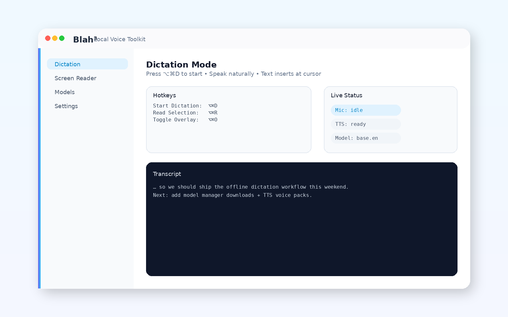
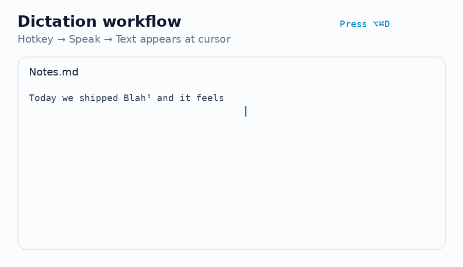

# Blah³ (BlahBlahBlah)

Local Voice Toolkit for macOS — Speech-to-Text and Text-to-Speech with AI models running 100% offline on Apple Silicon.

**Website:** [https://blah3-website.vercel.app](https://blah3-website.vercel.app)

<p align="center">
  
</p>

<p align="center">
  
</p>

## Features

- **Dictation Mode**: Press a global hotkey → speak → text appears wherever your cursor is
- **Screen Reader**: Select text anywhere → press hotkey → hear it read aloud with AI voice
- **Model Manager**: Download, switch, and manage STT/TTS models
- **100% Offline**: All processing happens locally on your Mac

## Tech Stack

- **Frontend**: React + Tailwind CSS
- **Backend**: Rust + Tauri v2
- **STT Engine**: whisper-rs (whisper.cpp with CoreML/Metal acceleration)
- **TTS Engine**: kokoro-tiny (Kokoro-82M via ONNX Runtime)

## Requirements

- macOS 14.0 (Sonoma) or later
- Apple Silicon (M1/M2/M3) recommended
- 16GB+ RAM recommended

## Development

### Prerequisites

```bash
# Rust toolchain
curl --proto '=https' --tlsv1.2 -sSf https://sh.rustup.rs | sh

# Xcode CLI tools
xcode-select --install

# Node.js
brew install node

# pnpm (recommended)
brew install pnpm
# or: npm install -g pnpm
# or: corepack enable && corepack prepare pnpm@latest --activate

# espeak-ng (for TTS phonemization)
brew install espeak-ng

# Tauri CLI
cargo install tauri-cli --version "^2"
```

### Setup

This project uses **pnpm** by default, but you can use any package manager.

#### Using pnpm (recommended)

```bash
# Install dependencies
pnpm install

# Development mode
cargo tauri dev

# Production build
cargo tauri build
```

#### Using npm

```bash
# Install dependencies
npm install

# Update tauri.conf.json beforeDevCommand and beforeBuildCommand to use npm:
# "beforeDevCommand": "npm run dev"
# "beforeBuildCommand": "npm run build"

# Development mode
cargo tauri dev

# Production build
cargo tauri build
```

#### Using yarn

```bash
# Install dependencies
yarn install

# Update tauri.conf.json beforeDevCommand and beforeBuildCommand to use yarn:
# "beforeDevCommand": "yarn dev"
# "beforeBuildCommand": "yarn build"

# Development mode
cargo tauri dev

# Production build
cargo tauri build
```

#### Using bun

```bash
# Install dependencies
bun install

# Update tauri.conf.json beforeDevCommand and beforeBuildCommand to use bun:
# "beforeDevCommand": "bun run dev"
# "beforeBuildCommand": "bun run build"

# Development mode
cargo tauri dev

# Production build
cargo tauri build
```

## Project Structure

```
blah3/
├── src-tauri/          # Rust backend
│   ├── src/
│   │   ├── commands/   # Tauri commands
│   │   ├── audio/      # Audio capture/playback
│   │   ├── engines/    # STT/TTS engines
│   │   └── models/     # Model management
│   └── Cargo.toml
├── src/                # React frontend
│   ├── components/     # UI components
│   ├── hooks/          # React hooks
│   └── lib/            # Utilities
└── package.json
```

## Default Hotkeys

- **Dictation**: `⌘ + ⇧ + D` (hold to record)
- **Read Aloud**: `⌘ + ⇧ + S` (read selected text)

## License

MIT
